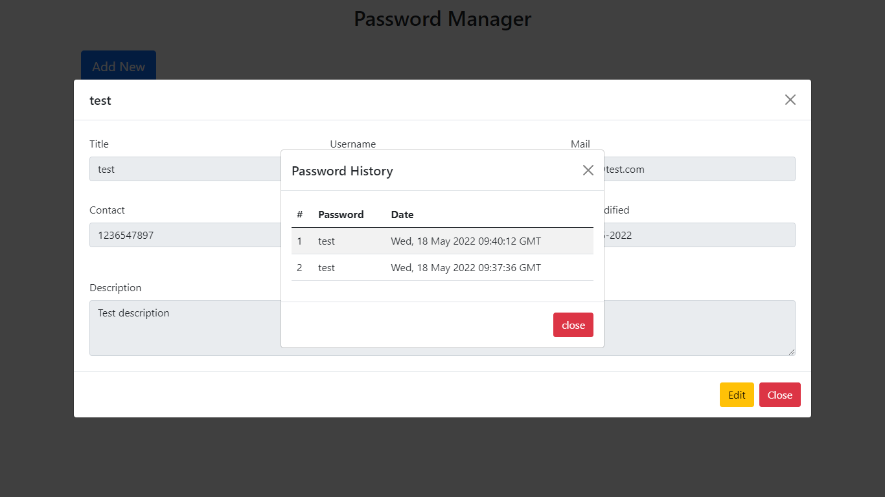

# This is frontend for **password manager** web app

> Note: node should be pre installed in the system
> if don't have, then you can download and install it from https://nodejs.org

---

> before this backend setup or api should be configured
> https://github.com/TestRapid/psmgr_backend

---

After pulling the code
steps to run the application, follow the command below:

-   Installing dependencies

```
	npm install
```

-   Running in development mode

```
	npm start
```

-   Creating the production build

```
	npm run build
```

---

## Some operations

-   ### Home page

    

-   ### Add a password account

    

-   ### Edit

    

-   ### Update the old password

    

-   ### History of passwords

    
